

  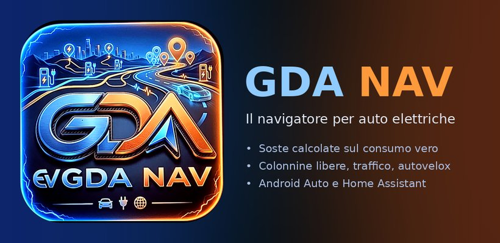

<h3 align="center">Il navigatore per chi guida un'auto elettrica. E va bene anche per la termica.</h3>

  Ti porta a destinazione con la voce, ti avvisa di code, polizia e autovelox, 
  e con l'auto elettrica ti dice dove fermarti a caricare e con quanta batteria arrivi.

  Android · iPhone · Android Auto · CarPlay · Home Assistant

---

## Cosa fa

### Ti porta a destinazione

Scrivi dove vuoi andare, scegli fra le strade proposte e premi **Avvia**. La
voce ti dice cosa fare e quando, in alto vedi la prossima manovra con il
cartello dell'uscita, e prima degli svincoli compaiono **le corsie giuste**,
accese in blu. Vicino all'uscita la manovra si apre in una **vista 3D dello
svincolo**.

In basso l'ora di arrivo, i chilometri che mancano, la velocità con il
**limite** della strada e, con l'elettrica, la batteria che hai adesso e
quella con cui arrivi.

  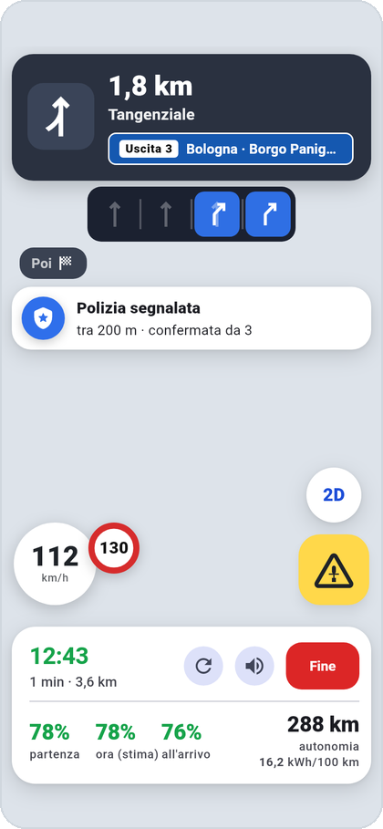
  &nbsp;
  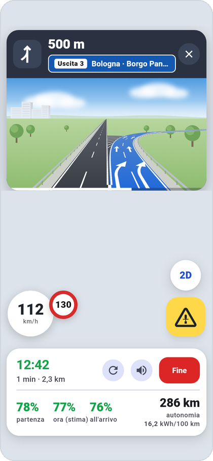

Nel percorso si possono aggiungere **tappe**, e nelle opzioni si sceglie come
guidare (più veloce, equilibrato, risparmio) e cosa evitare: **pedaggi,
autostrade, traghetti**. Se il **traffico** cambia e c'è una strada più
veloce, gdanav te la propone.

### Segnalazioni della comunità, come Waze

Un tocco sul triangolo giallo e segnali quello che vedi: traffico, polizia,
incidente, pericolo, lavori, strada chiusa, autovelox. Chi passa dopo di te
riceve l'avviso a voce e sullo schermo («Polizia segnalata, tra 200 metri»),
e dopo averla passata può dire se c'è ancora o no: così le segnalazioni
vecchie spariscono da sole.

Gli **autovelox fissi** di Italia e dintorni sono già dentro l'app, anche
senza rete.

  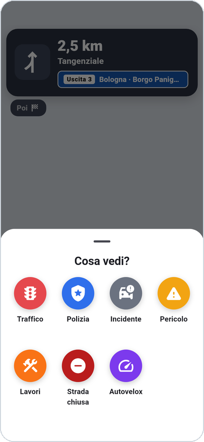

### Con l'auto elettrica: consumi e soste

gdanav calcola quanto consumi **tratto per tratto**: velocità, salite e
discese, vento, temperatura esterna e clima acceso. Ti dice con quanta
batteria arrivi e, se non basta, **dove fermarti e quanto caricare**, con le
colonnine libere o occupate in quel momento.

Il grafico mostra la batteria lungo tutto il viaggio: dove scende, dove ricarichi, con quanto arrivi.

  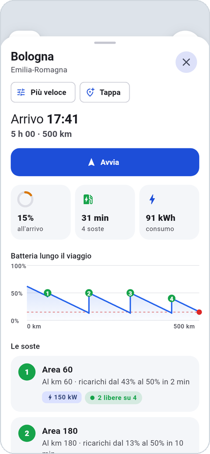
  &nbsp;
  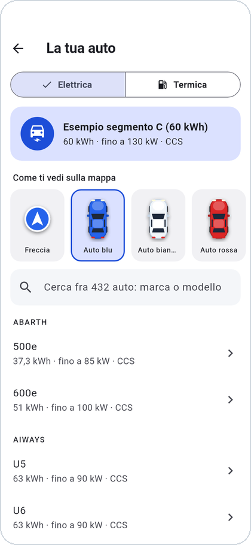

In **La tua auto** scegli il modello fra più di 400 auto elettriche: batteria,
potenza di ricarica e presa li sa già gdanav.

### Con l'auto termica: distributori e prezzi

Scegli **Termica** in La tua auto e il carburante che fai. gdanav diventa un
navigatore normale, senza batteria e colonnine, e con il tasto arancione ti
mostra i **distributori vicini con i prezzi del giorno**, presi
dall'Osservaprezzi carburanti del Ministero (MIMIT): dal più vicino o dal più
economico, self o servito. Anche durante il viaggio: tocchi un distributore,
ci passi e poi il viaggio prosegue.

  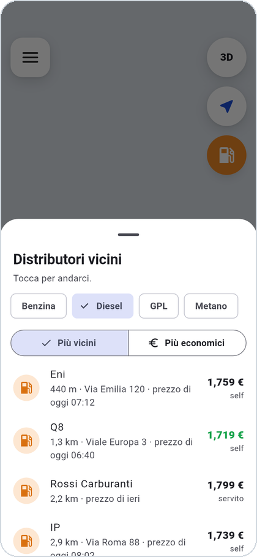

### E poi

- **Meteo lungo il viaggio**: che tempo e che temperatura trovi lungo la
  strada, all'ora in cui ci passi. Con l'elettrica entrano anche nel calcolo
  dei consumi.
- **Android Auto e CarPlay**: mappa, guida, segnalazioni e soste sullo
  schermo dell'auto.
- **Siri e «Ok Google»**: «Ehi Siri, portami a casa con gdanav», oppure «Ok
  Google, naviga verso…» scegliendo gdanav.
- **Mappe offline**: scarichi le regioni che ti servono e la mappa c'è anche
  senza rete.
- **Casa, Lavoro e preferiti**, anche importati dai posti salvati di Google
  Maps.
- **Home Assistant**: la batteria letta dalla tua casa, e la casa che sa del
  tuo viaggio. Più sotto come si collega.

  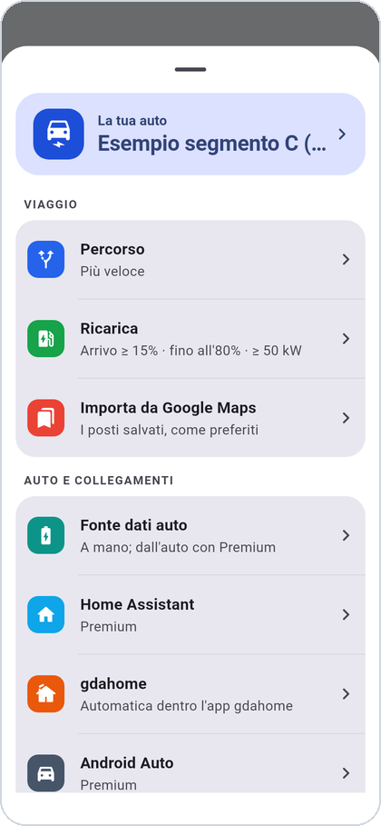

## Come si usa

1. **Installa gdanav** dal **Play Store** (Android) o dall'**App Store**
   (iPhone).
2. Apri il menu (☰) → **La tua auto**: scegli **Elettrica** o **Termica**.
   Con l'elettrica cerca il tuo modello; con la termica scegli il carburante.
3. **La batteria** (solo elettrica): la scrivi tu con il cursore in **Fonte
   dati auto**, e gdanav la stima man mano che guidi. Con Premium la legge da
   sola: dall'auto con Android Auto, da un dongle OBD Bluetooth, da gdahome o
   da Home Assistant.
4. **Pianifica il viaggio**: tocca «Dove andiamo?», scrivi la destinazione,
   guarda arrivo, durata e soste, e premi **Avvia**.

  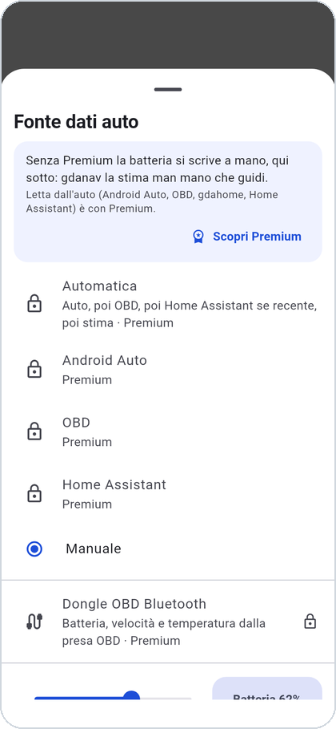
  &nbsp;
  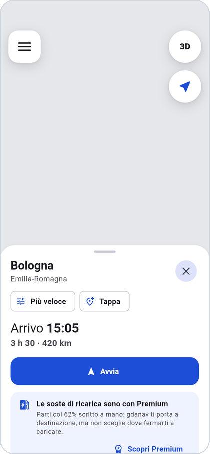

Senza Premium, con l'elettrica gdanav ti porta a destinazione con la batteria
che hai scritto, ma non sceglie dove fermarti a caricare: te lo dice nella
scheda del viaggio.

## Prezzi

gdanav si scarica gratis. Non ha pubblicità e non chiede di creare un account.

| | Gratis | Premium |
| --- | :---: | :---: |
| Percorso, guida con la voce, corsie, svincoli in 3D | ✓ | ✓ |
| Traffico, autovelox, segnalazioni della comunità, meteo | ✓ | ✓ |
| Auto termica: distributori con i prezzi del giorno | ✓ | ✓ |
| Auto elettrica con la batteria scritta a mano | ✓ | ✓ |
| Mappe offline, preferiti, Siri e «Ok Google» | ✓ | ✓ |
| Batteria letta dall'auto: Android Auto, dongle OBD, gdahome, Home Assistant | | ✓ |
| Percorso con le soste di ricarica, colonnine libere o occupate | | ✓ |
| Home Assistant | | ✓ |
| Android Auto e CarPlay | | ✓ |

**Premium costa 2,99 € al mese oppure 29,99 € all'anno** (l'anno costa il
16% in meno). I **primi 14 giorni sono gratis**, una volta sola: se disdici
durante la prova non paghi niente. Si compra dal menu → **Premium**, si paga
e si disdice dal Play Store o dall'App Store, e il rinnovo è automatico.

  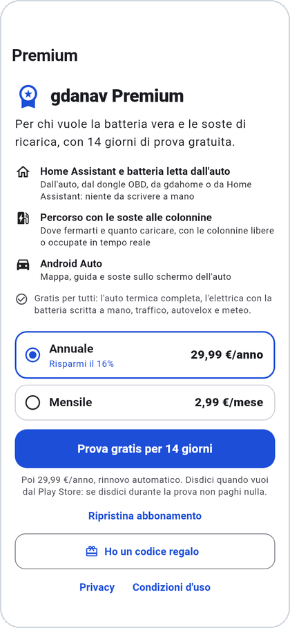
  &nbsp;
  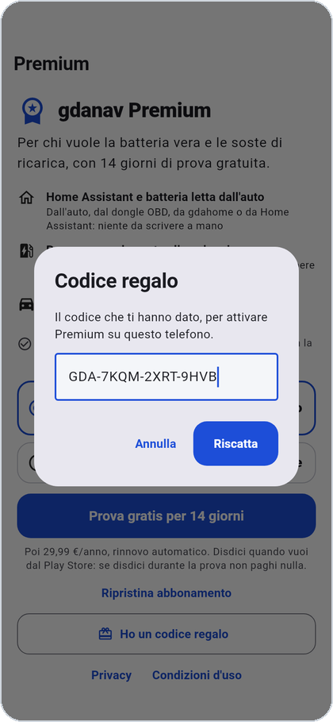

**Codice regalo.** Se qualcuno ti ha regalato Premium hai un codice come
`GDA-7KQM-2XRT-9HVB`: menu → **Premium** → **Ho un codice regalo**, lo scrivi
e premi **Riscatta**. Vale per qualche mese o per sempre, secondo il codice.
I codici e le licenze gdanav li può dare anche **l'installatore** che ti ha
montato gdahome.

**Hai gdahome Premium?** Allora hai già anche **gdanav Premium**: è compreso.
Dentro l'app gdahome gdanav non ti chiede niente, lo sblocca gdahome.

  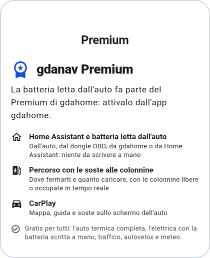

## Home Assistant

Con Home Assistant gdanav legge la batteria della tua auto dalla casa, e la
casa sa del tuo viaggio: dove vai, quando arrivi, con quanta batteria. Serve
Premium.

**Installare l'integrazione**

1. In Home Assistant apri **HACS** → i tre puntini in alto → **Repository
   personalizzati**. Incolla `https://github.com/danigio15/gdanav`, categoria
   **Integrazione**.
2. Cerca **gdanav** in HACS, installalo e **riavvia** Home Assistant.
3. **Impostazioni → Dispositivi e servizi → Aggiungi integrazione → gdanav.**
   Scegli il dispositivo della tua auto: gdanav riconosce da solo batteria,
   autonomia, ricarica e il resto. Controlla e conferma: serve solo la
   batteria.

**Collegare l'app**

4. In Home Assistant apri il dispositivo **gdanav «la tua auto»**: c'è un
   **QR di abbinamento**.
5. Nell'app: menu → **Home Assistant** → inquadra il QR. Se non puoi
   inquadrarlo, in Home Assistant premi **Nuovo codice di abbinamento** e
   scrivi nell'app il codice che compare (vale dieci minuti).

> Il QR è la chiave della tua auto: chi lo inquadra ne legge i dati.
> Mostralo solo a chi deve usare l'app.

**Cosa trovi in Home Assistant**

| Entità | Cosa dice |
| --- | --- |
| `sensor.gdanav_destinazione` | dove sta andando l'auto |
| `sensor.gdanav_eta` | l'ora di arrivo prevista |
| `sensor.gdanav_soc_arrivo` | la batteria all'arrivo |
| `sensor.gdanav_prossima_sosta` | la prossima sosta di ricarica |
| `sensor.gdanav_soc_necessario` | la batteria che serve per il prossimo viaggio: la wallbox può caricare fin lì |
| `binary_sensor.gdanav_in_viaggio` | acceso mentre sei in viaggio |
| `binary_sensor.gdanav_app_collegata` | l'app è collegata adesso |

Con due auto, le entità della seconda finiscono con `_2`.

- **Automazioni**: l'evento `gdanav_evento` arriva con il tipo `partenza`,
  `arrivo`, `arrivo_vicino`, `inizio_ricarica` o `fine_ricarica`. Per esempio:
  «quando sto arrivando, apri il cancello».
- **Mandare una meta all'app**: il servizio `gdanav.pianifica_viaggio`, con la
  destinazione (e se vuoi l'ora di partenza).
- **Preparare l'auto dall'app**: nelle opzioni dell'integrazione scegli quali
  script, pulsanti o scene l'app può avviare (per esempio il
  pre-condizionamento). L'app può avviare solo quelli.

I dati fra l'app e la casa viaggiano **cifrati**: li leggono solo il tuo
telefono e la tua Home Assistant. Non devi aprire nessuna porta di casa.

## I tuoi dati

Niente account, niente pubblicità, niente statistiche d'uso: gdanav non
raccoglie dati per profilarti e non li vende. Cosa esce dal telefono, e
verso chi, è scritto nell'informativa:
**[gdanav.gdahome.org/privacy](https://gdanav.gdahome.org/privacy)**.

Mappe e dati: © OpenStreetMap contributors, © Open Charge Map contributors,
OpenFreeMap, TomTom (traffico e colonnine in tempo reale), MET Norway (meteo),
MIMIT (prezzi dei carburanti).

## Licenza

Il codice è pubblico perché chiunque possa controllare cosa fa con l'auto, la
posizione e i dati di chi lo usa. Non è open source:
[licenza proprietaria](LICENSE), tutti i diritti riservati. Puoi installarlo e
usarlo per te; non puoi ripubblicarlo, distribuirlo modificato o usarlo
commercialmente senza permesso scritto.

---

Per chi sviluppa: [docs/SVILUPPO.md](docs/SVILUPPO.md)
