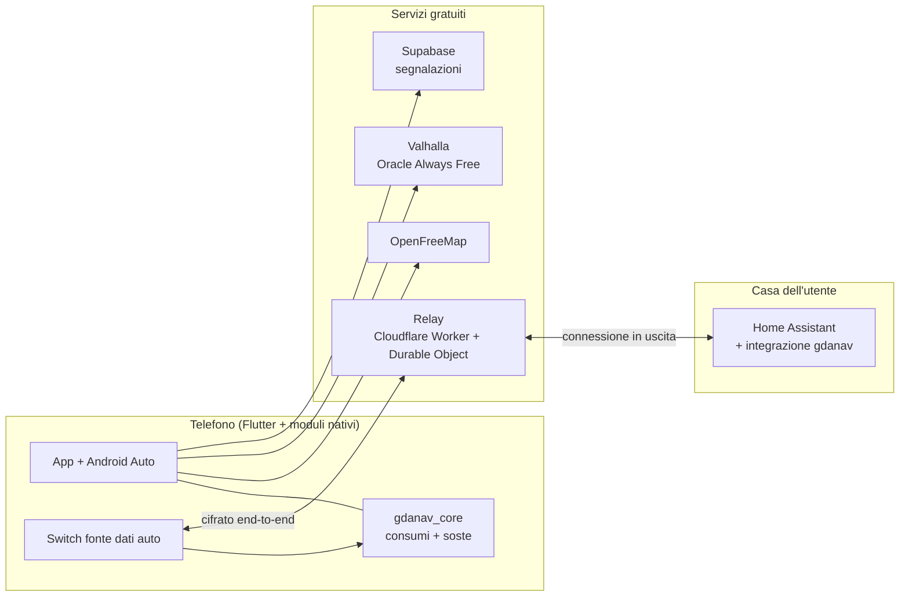

# Architettura

## Tre principi

1. **Il calcolo sta sul telefono.** Mappa, guida, consumi e soste girano
   sull'app: ogni utente porta la sua potenza di calcolo.
2. **Il server fa due cose**: i percorsi (Valhalla) e la community
   (segnalazioni, traffico). Il resto viene da servizi gratuiti o file statici.
3. **Chi costa, paga**: le funzioni che consumano server stanno nel Premium.

## I pezzi

## I dati dell'auto

Il motore legge sempre uno `StatoAuto`, che porta con sé sorgente e ora.
L'`ArbitroSorgenti` decide quale vale:

| Sorgente | Fresca se più giovane di | Note |
| --- | --- | --- |
| Android Automotive | 30 s | solo auto con Google integrato |
| Android Auto | 30 s | `CarInfo`: molte auto non passano la batteria |
| OBD-II BLE | 30 s | il dongle lo compra l'utente |
| Home Assistant | 5 min | le integrazioni dei costruttori aggiornano piano |
| Manuale | — | solo punto di partenza della stima |

In **Automatica** vince la prima fresca in quest'ordine; se nessuna lo è, si
parte dalla lettura più recente e si toglie l'energia consumata dopo
(sorgente `stima`). In modalità **Fissa** si usa solo quella scelta. Su
iPhone CarPlay non dà i dati dell'auto: restano Home Assistant, OBD e
manuale.

## Consumi e soste

`energiaTrattoWh` somma aerodinamica (con vento e densità dell'aria),
rotolamento, pendenza (con recupero in discesa), elettronica e clima stimato
dalla temperatura. `PianificatoreSoste` cerca il tempo totale minimo con un
Dijkstra sugli stati «colonnina, batteria all'arrivo», con la batteria a
passi dell'1% arrotondati per difetto, soglie minime per sosta e arrivo e la
curva di ricarica del modello.

## Percorso e colonnine

1. `ClienteValhalla.calcola` chiede `/route` con `elevation_interval: 30`.
   Ogni segmento del tracciato diventa un `Tratto`: velocità dalla sua
   manovra, dislivello dal profilo altimetrico (le quote a -500 vogliono dire
   «niente modello del terreno» e si ignorano).
2. Se la batteria basta, fine: niente richieste per le colonnine.
3. Altrimenti `ClienteOpenChargeMap.lungo` chiede per `polyline` le
   colonnine entro 3 km; `unisciColonnine` sostituisce le prese con quelle in
   tempo reale di OCPI (PUN) quando una location è entro 60 m.
4. `colonnineSulPercorso` le proietta sul tracciato (dove si esce, quanto si
   devia, ×1,4 perché le strade girano) e tiene quelle compatibili sopra i
   40 kW.
5. `PianificatoreSoste` sceglie le soste.

## Costi

Zero al lancio. Il primo server a pagamento (~50 €/mese) arriva con gli
utenti e si copre con 15–20 abbonati Premium.
